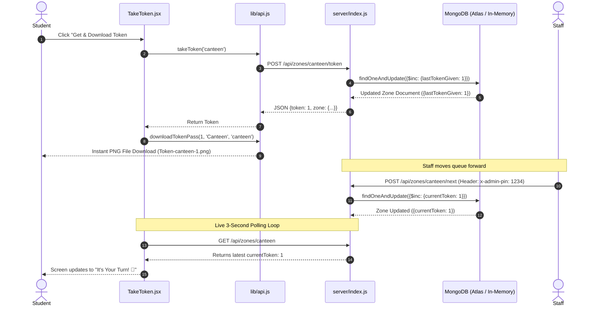

# QueueLess — Virtual Token System 🎟️

**QueueLess** is a full-stack MERN web application that replaces physical waiting lines at university canteens, libraries, labs, and office counters with a real-time virtual token system.

Students take a token online, see their live queue position, estimated wait time, auto-download their ticket pass PNG, and walk away until their turn is called. Staff manage the queue from a PIN-protected control dashboard with one simple click.

---

## 🍃 Are We Using MongoDB or Not?

### **YES, we are using MongoDB!**

QueueLess uses **MongoDB** as its primary database, powered by the **Mongoose** Object Data Modeling (ODM) library.

### 🧠 Dual-Mode Database Connection Logic (`server/index.js`):
1. **Standard MongoDB Connection**:
   - The backend attempts to connect to your MongoDB instance configured in `server/.env` via `MONGO_URI` (`mongodb://localhost:27017/queueless` or cloud **MongoDB Atlas**).
2. **Automatic In-Memory Fallback (`MongoMemoryServer`)**:
   - If local MongoDB service is not running on your machine, QueueLess automatically boots an **in-memory MongoDB server** (`mongodb-memory-server`) in RAM.
   - **Why this is awesome**: It provides a **real MongoDB engine** with full Mongoose querying, schema validation, and atomic operations without requiring you to manually install or start MongoDB!

---

## 🏗️ Architecture & How Each Code File Works

```
queueless/
├── client/                      # React Frontend (Vite + Tailwind CSS v4)
│   ├── src/
│   │   ├── components/
│   │   │   ├── TokenDisplay.jsx # Digital Pass Card with "This Is Your Token" & Download option
│   │   │   └── ZoneCard.jsx     # Live Zone Card component on the homepage grid
│   │   ├── lib/
│   │   │   ├── api.js           # REST API fetch calls + downloadTokenPass Canvas utility
│   │   │   └── usePolling.js    # Custom 3s auto-polling hook with reconnect detection
│   │   ├── pages/
│   │   │   ├── Home.jsx         # Zone Selection Grid showing real-time queue stats
│   │   │   ├── TakeToken.jsx    # Student Token Page: Token generation & instant PNG download
│   │   │   └── Admin.jsx        # Staff Dashboard: Protected by PIN to serve next/reset queue
│   │   ├── App.jsx              # Navigation header and React Router routes
│   │   ├── index.css            # Custom CSS glow animations & Tailwind design tokens
│   │   └── main.jsx             # React DOM entry point
│   └── vite.config.js           # Vite development server & API proxy config
└── server/                      # Node.js + Express Backend
    ├── models/
    │   └── Zone.js              # Mongoose Schema for Queue Service Zones
    └── index.js                 # Express REST API, MongoDB connection & atomic operations
```

---

## 📜 Detailed Code & File Breakdown

### 🖥️ Backend (`server/`)

#### 1. `server/models/Zone.js` — Mongoose Database Schema
Defines the structure for every queue zone (e.g. Canteen, Library, Lab, Office) in MongoDB:
- `slug` (String, Unique): URL identifier (e.g., `"canteen"`).
- `name` (String): Display title (e.g., `"Canteen"`).
- `currentToken` (Number): Token number currently being served at the counter.
- `lastTokenGiven` (Number): Highest token number issued to a student so far.
- `avgTimePerPerson` (Number): Average service time in minutes (used to calculate estimated wait times).

#### 2. `server/index.js` — Backend API Entry Point & Express Server
- **Database Seeding**: Checks `Zone.countDocuments()`. If empty, seeds initial default zones (*Canteen, Library, Lab, Office*).
- **Atomic MongoDB Operations**:
  - `POST /api/zones/:slug/token`: Atomically increments `lastTokenGiven` by `1` using `findOneAndUpdate` with `{ $inc: { lastTokenGiven: 1 } }`. This ensures concurrent student requests **never** produce duplicate token numbers.
  - `POST /api/zones/:slug/next`: Staff PIN-authenticated route. Atomically increments `currentToken` by `1` up to `lastTokenGiven`.
  - `POST /api/zones/:slug/reset`: Resets queue tokens back to `0`.

---

### 🎨 Frontend (`client/`)

#### 3. `client/src/lib/api.js` — API Layer & Canvas Ticket Generator
- **HTTP Handlers**: Exposes clean async functions (`fetchZones`, `fetchZone`, `takeToken`, `serveNextToken`, `resetZone`).
- **`downloadTokenPass(myToken, zoneName, slug)`**: Uses HTML5 Canvas 2D context to draw a high-resolution dark mode ticket pass containing:
  - Header & Zone Title
  - **THIS IS YOUR TOKEN #X** text
  - Timestamp, Counter Zone, Barcode simulation, and Unique Reference Code
  - Triggers an instant PNG download (`Token-canteen-1.png`) directly to the user's browser.

#### 4. `client/src/lib/usePolling.js` — Custom Real-Time Hook
- Executes automatic polling every 3 seconds to keep queue counts live across student screens and staff dashboards.
- Handles network dropouts gracefully and provides `isReconnecting` status flags.

#### 5. `client/src/pages/Home.jsx` — Zone Selector Landing Page
- Displays grid of service counters with live counts ("Serving Now", "People Waiting").
- Features a quick-access button to jump straight to the Admin panel.

#### 6. `client/src/pages/TakeToken.jsx` — Student Token Page
- Handles token state persistence in browser `localStorage`.
- Clicking **"Get & Download Token"**:
  1. Requests token from backend API.
  2. Saves token locally.
  3. Displays success modal.
  4. Automatically triggers `downloadTokenPass()` to save the ticket PNG to device.
- Handles edge cases like missed turn (`savedToken < currentToken`) or queue reset.

#### 7. `client/src/pages/Admin.jsx` — Staff Control Panel
- Protected by PIN input (`Default: 1234`).
- Allows staff to click **"Next Token"** to call the next student in line or **"Reset Queue"**.

#### 8. `client/src/components/TokenDisplay.jsx` — Visual Digital Pass Card
- Displays explicit **"This Is Your Token"** card with large glowing token number, barcode, wait stats, and a **Download Token Pass** button.

---

## 🔄 System Data Flow & Connectivity



---

## ⚡ Core Queue Metrics & Formulas

All queue metrics are dynamically calculated on the client to avoid bloated database writes:

- **Next Available Token**: `nextToken = lastTokenGiven + 1`
- **People Waiting**: `peopleWaiting = max(0, lastTokenGiven - currentToken)`
- **People Ahead of Me**: `peopleAhead = max(0, myToken - currentToken)`
- **Estimated Wait Time**: `estimatedWait = peopleAhead * avgTimePerPerson` (minutes)

---

## 🛠️ How to Run Locally

### Prerequisites
- **Node.js**: v18 or higher
- **MongoDB** *(Optional — fallback in-memory MongoDB boots automatically if local Mongo is not running)*

### 1. Run Backend Server (`queueless/server`)
```bash
cd queueless/server
npm install
npm run dev
```
*Server starts on `http://localhost:4000`*

### 2. Run Frontend Client (`queueless/client`)
```bash
cd queueless/client
npm install
npm run dev
```
*Frontend starts on `http://localhost:5173`*

---

## 💻 How to Run Everything in VS Code (Step-by-Step)

### Step 1: Open the Project in VS Code
1. Launch **VS Code**.
2. Go to **File > Open Folder...** and select the project folder (`web` or `queueless`).

---

### Step 2: Open Two VS Code Terminals
In VS Code, open the built-in terminal by pressing **`Ctrl + \``** (or `Cmd + \`` on Mac), or click **Terminal > New Terminal** in the top menu bar.

#### 🟢 Terminal 1: Run Backend Server
```bash
# 1. Navigate to server folder
cd server

# 2. Start backend server
npm run dev
```
> **What you will see in Terminal 1:**
> ```
> 🚀 QueueLess Server running on http://localhost:4000
> ✅ Initialized default zones (Canteen, Library, Lab, Office)
> ```

#### 🔵 Terminal 2: Run Frontend Client
Click the **`+`** icon on the top-right of the VS Code terminal window to split or add a second terminal tab:
```bash
# 1. Navigate to client folder
cd client

# 2. Start frontend development server
npm run dev
```
> **What you will see in Terminal 2:**
> ```
>   ➜  Local:   http://localhost:5173/
> ```

---

### Step 3: Open in Browser
Open your browser and navigate to:
- **Student View**: [http://localhost:5173](http://localhost:5173)
- **Staff Admin Dashboard**: [http://localhost:5173/admin](http://localhost:5173/admin) *(Default Admin PIN: `1234`)*

---

## 🔍 How to See & Explain MongoDB Configuration

When explaining the project, here is exactly where the MongoDB configuration lives and how to present it step-by-step:

### 1. The Configuration File (`server/.env`)
Open file [`queueless/server/.env`](file:///Users/adithyan.s/Desktop/web/queueless/server/.env) in VS Code:
```env
PORT=4000
MONGO_URI=mongodb://localhost:27017/queueless
ADMIN_PIN=1234
```
- **`MONGO_URI`**: Tells Mongoose where the MongoDB database is located.

---

### 2. The Connection Logic File (`server/index.js`)
Open file [`queueless/server/index.js`](file:///Users/adithyan.s/Desktop/web/queueless/server/index.js) and scroll to line 35 (`connectDB` function):

```javascript
const connectDB = async () => {
  const uri = process.env.MONGO_URI || 'mongodb://localhost:27017/queueless';
  try {
    // 1. Try connecting to local/cloud MongoDB
    await mongoose.connect(uri, { serverSelectionTimeoutMS: 3000 });
    console.log(`Connected to MongoDB at ${uri}`);
  } catch (err) {
    // 2. If MongoDB isn't running, automatically fallback to in-memory Mongo!
    console.log('Starting MongoMemoryServer as fallback...');
    const { MongoMemoryServer } = await import('mongodb-memory-server');
    const mongod = await MongoMemoryServer.create();
    const memUri = mongod.getUri();
    await mongoose.connect(memUri);
    console.log(`Connected to MongoMemoryServer at ${memUri}`);
  }
};
```

---

### 🗣️ Simple 3-Sentence Explanation Script (To Explain to Anyone!):

> 1. *"Our application uses **MongoDB** with **Mongoose ODM** to store all service counter data like token numbers and wait times."*
> 2. *"The database configuration is stored in `server/.env` as `MONGO_URI`."*
> 3. *"In `server/index.js`, our server first tries connecting to a standard MongoDB database. If local MongoDB isn't turned on, it automatically boots an **in-memory MongoDB server (`MongoMemoryServer`)** in RAM so the application runs seamlessly out-of-the-box without crashing!"*

---

## 🔑 Default Credentials
- **Admin PIN**: `1234` (Configurable in `server/.env`)

